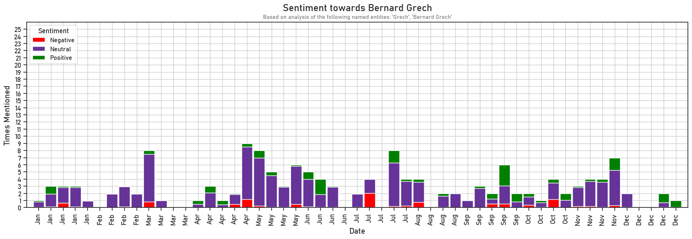
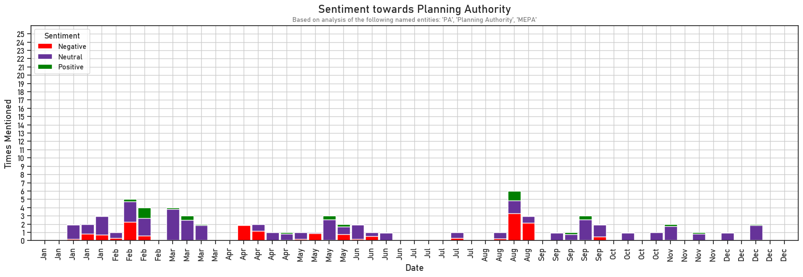
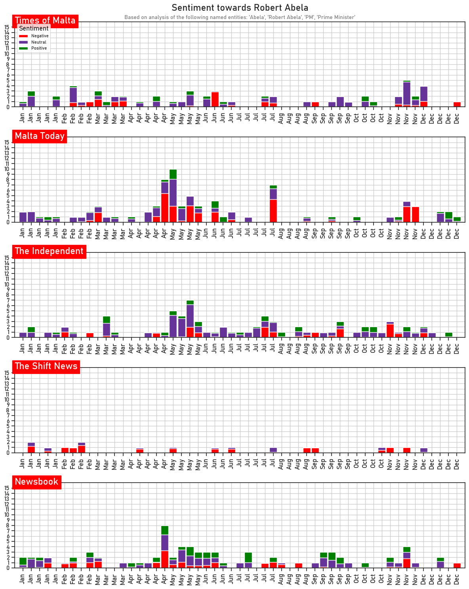

# News Sentiment Analysis
The following is a demonstration of a Target-dependent Sentiment Classifier (TSC) on Maltese news articles. It uses a Hamborg's [BERT-based model](https://huggingface.co/fhamborg/roberta-targeted-sentiment-classification-newsarticles) trained on the [NewsMTSC](https://github.com/fhamborg/NewsMTSC) dataset.

This demonstration processes news articles from various Maltese newspapers, classifies the sentiment towards specific targets, and visualises the results.
The data is visualised in two ways:
1. **Aggregate Chart**: The `get_aggregate_sentiment` function generates an aggregate sentiment chart for a given target over time.
2. **Grouped by Newspaper**: The `get_grouped_sentiment` function generates sentiment charts grouped by newspaper, allowing for a comparison of sentiment across different sources.

The helper program sentiment/target_sentiment_classifier.py performs Named Entity Recognition (NER) using multiprocessing(*), then performs TSC on the detected entities.

(*) Running multi-processing programs may not work on Google Colab.

## Visualisation showcase
### Aggregate Sentiment Chart

### Sentiment Grouped by Newspaper

